# 📊 Data Flows - iOS Stock Trading App

## Overview
This document maps all data flows in the application, showing how data moves between frontend components, backend services, databases, and external APIs.

## Table of Contents
- [Authentication Flows](#authentication-flows)
- [Stock Data Flows](#stock-data-flows)
- [Portfolio Management Flows](#portfolio-management-flows)
- [Alert System Flows](#alert-system-flows)
- [AI Insights Flows](#ai-insights-flows)
- [Real-time Data Flows](#real-time-data-flows)
- [Notification Flows](#notification-flows)

---

## Authentication Flows

### User Registration Flow
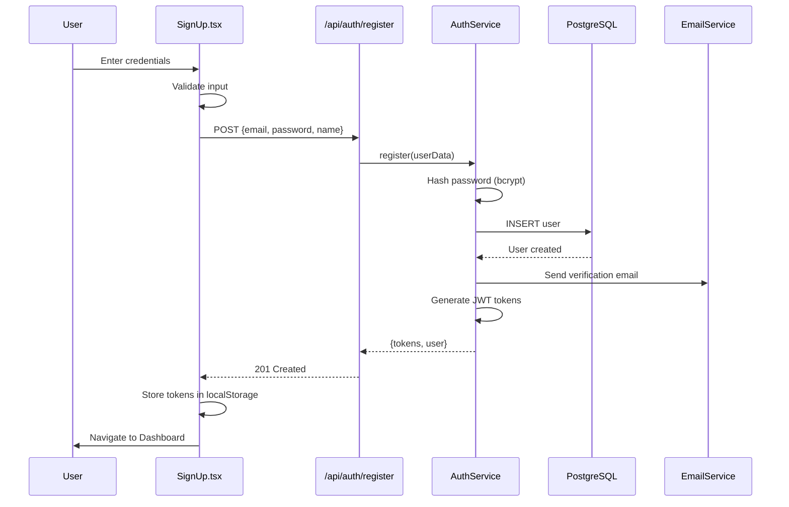

### User Login Flow
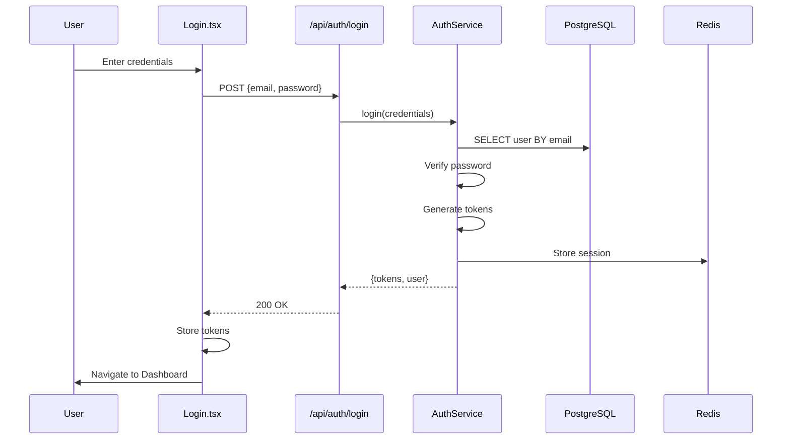

### Token Refresh Flow
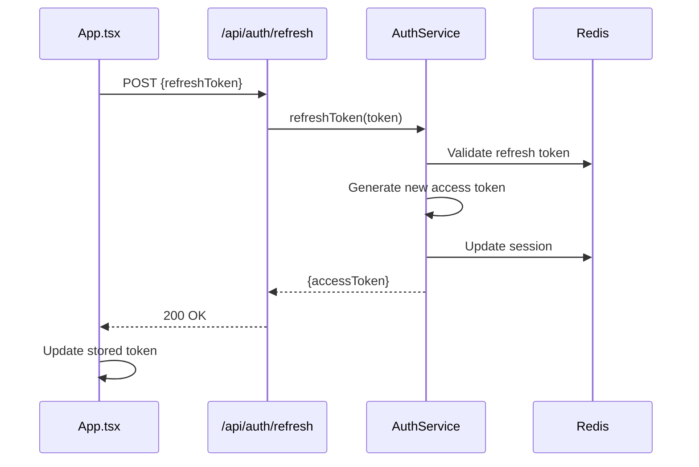

---

## Stock Data Flows

### Stock Search Flow
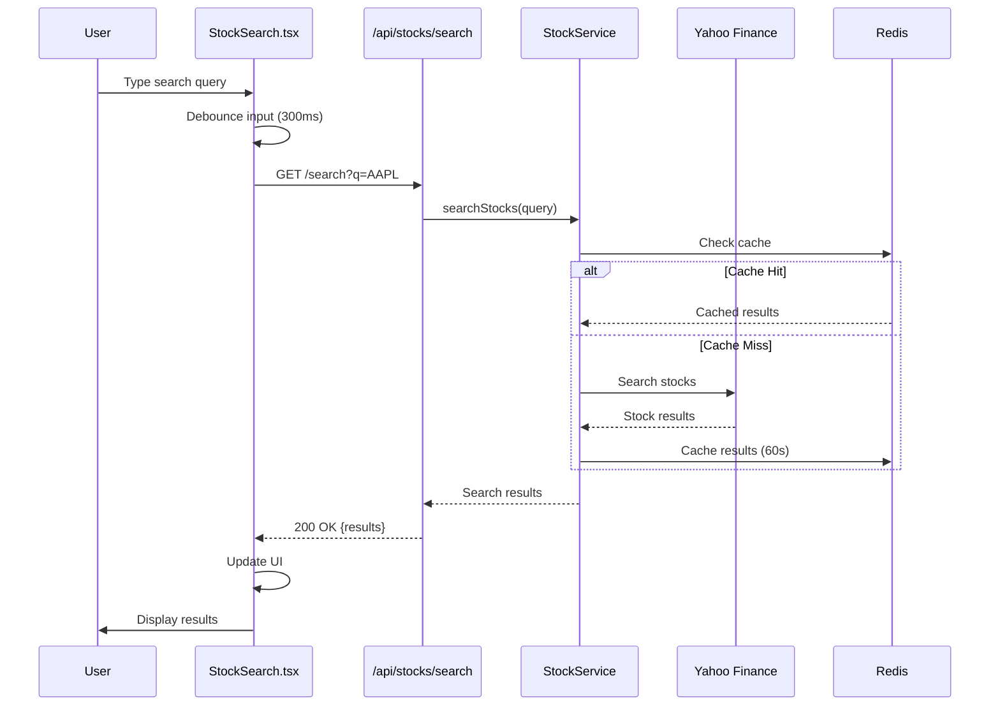

### Stock Details Flow
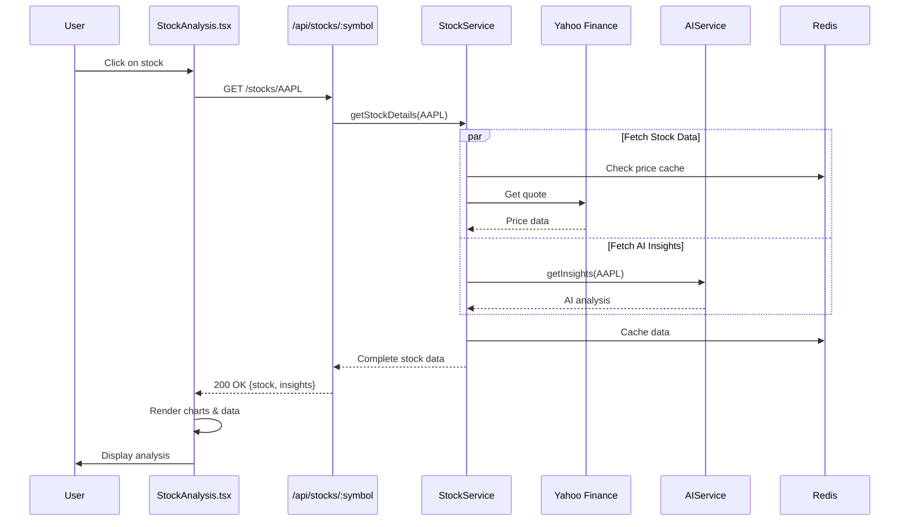

---

## Portfolio Management Flows

### Create Portfolio Entry Flow
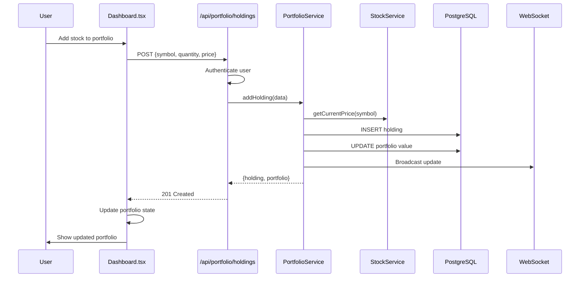

### Portfolio Performance Flow
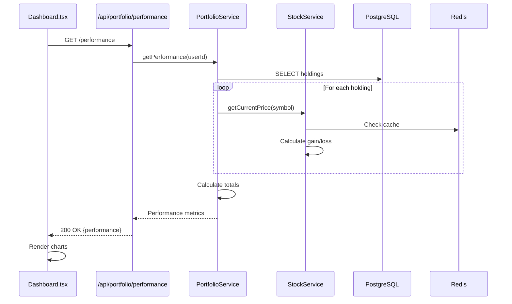

---

## Alert System Flows

### Create Alert Flow
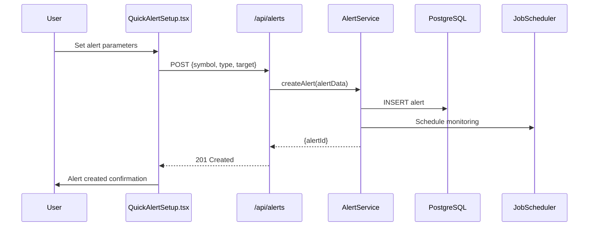

### Alert Monitoring Flow
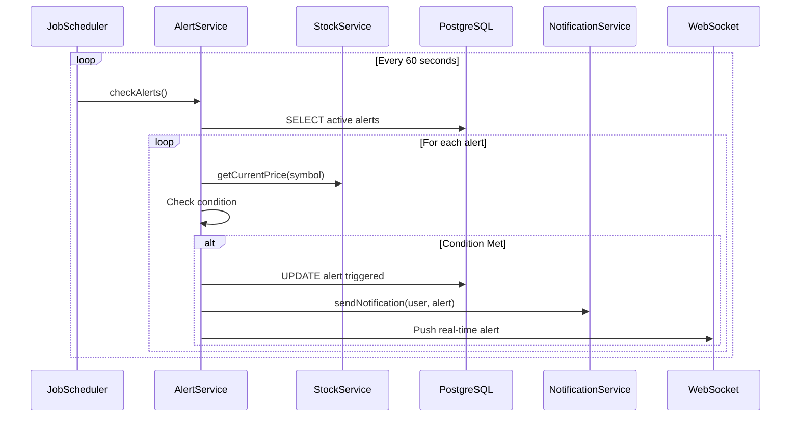

---

## AI Insights Flows

### Generate AI Analysis Flow
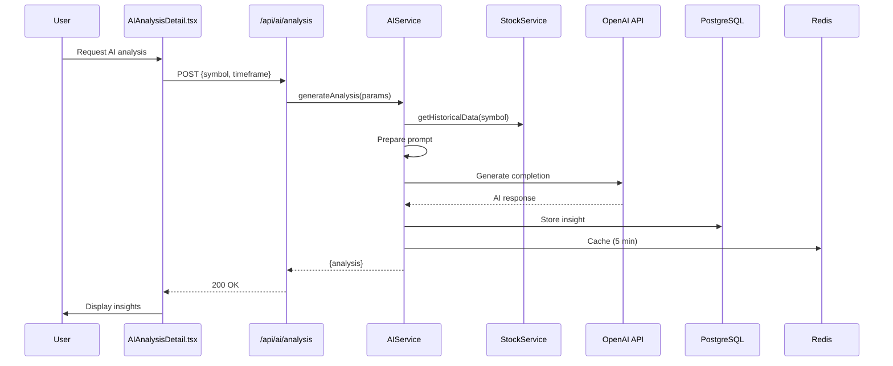

### Portfolio AI Recommendations Flow
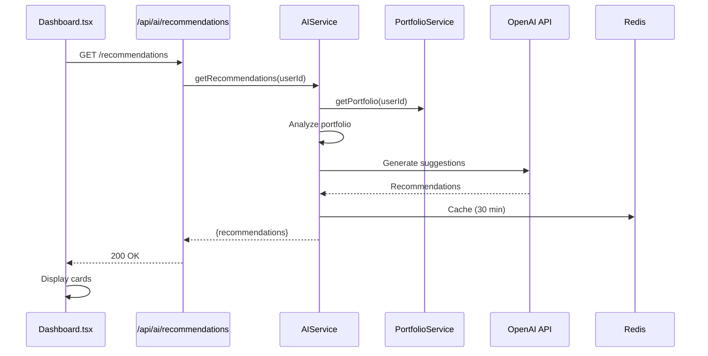

---

## Real-time Data Flows

### WebSocket Connection Flow
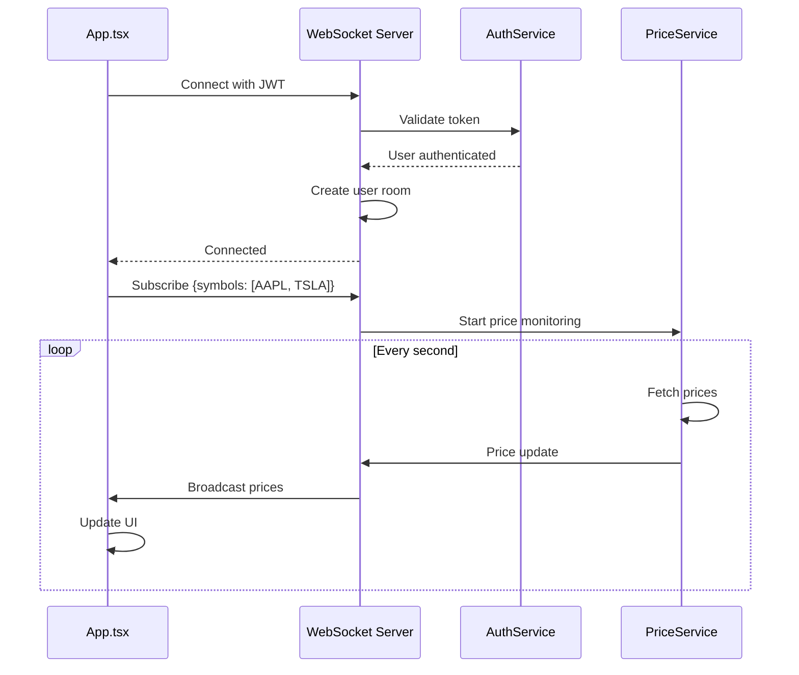

### Live Portfolio Updates Flow
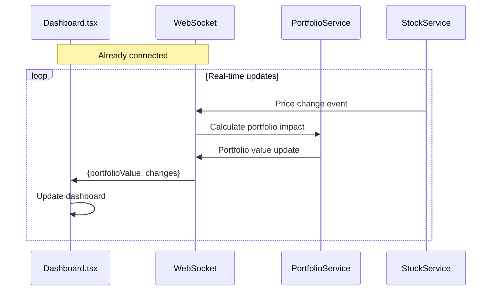

---

## Notification Flows

### Email Notification Flow
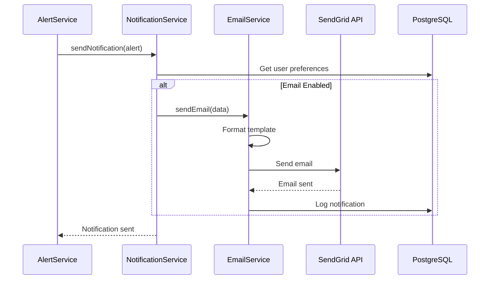

### Push Notification Flow (Future)
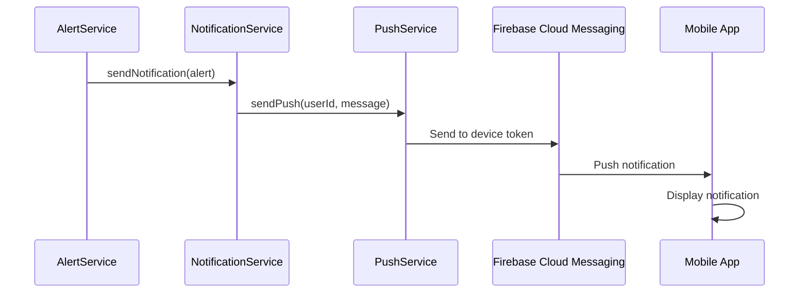

---

## State Management Flows

### Frontend State Updates
```
Component State Flow:
1. User Action → Component Event Handler
2. API Call → Loading State
3. API Response → Update Local State
4. Update Context/Global State (if needed)
5. Re-render Component → Update UI
```

### Authentication State
```javascript
// Central auth state management
AuthContext
├── user: User | null
├── tokens: {access, refresh}
├── isAuthenticated: boolean
├── login(): Promise<void>
├── logout(): void
└── refreshToken(): Promise<void>

// Components consuming auth state
Login.tsx → setUser() → All components re-render
Logout → clearUser() → Navigate to login
```

### Portfolio State
```javascript
// Portfolio state management
PortfolioContext
├── holdings: Holding[]
├── totalValue: number
├── performance: PerformanceMetrics
├── addHolding(): Promise<void>
├── removeHolding(): Promise<void>
└── refreshPortfolio(): Promise<void>

// Real-time updates
WebSocket → updateHolding() → Dashboard re-renders
```

---

## Error Handling Flows

### API Error Flow
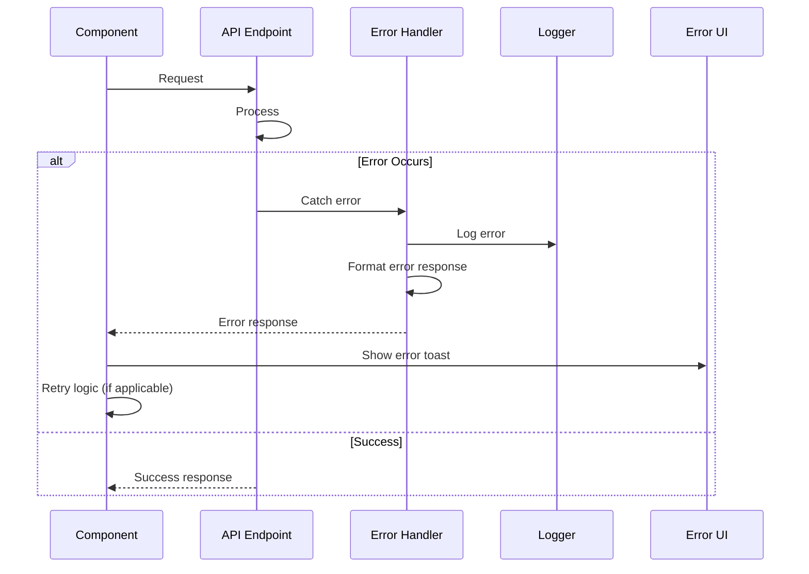

### Retry Logic Flow
```javascript
// Exponential backoff retry
async function retryableRequest(fn, maxRetries = 3) {
  for (let i = 0; i < maxRetries; i++) {
    try {
      return await fn()
    } catch (error) {
      if (i === maxRetries - 1) throw error
      await sleep(Math.pow(2, i) * 1000) // 1s, 2s, 4s
    }
  }
}
```

---

## Cache Strategy Flows

### Multi-layer Cache
```
Request → Redis Cache → Database → External API
   ↓         ↓              ↓            ↓
   Hit       Miss           Miss        Fetch
   ↓         ↓              ↓            ↓
Return    Check DB      Check API    Store in all
```

### Cache Invalidation
```javascript
// Cache TTL Strategy
Stock Prices: 60 seconds
Search Results: 2 minutes
AI Insights: 5 minutes
User Profile: 30 minutes
Portfolio: Real-time (WebSocket)

// Cache Invalidation Events
User Action → Update DB → Invalidate Cache
Price Change → Update Cache → Broadcast via WebSocket
```

---

## Data Synchronization Flows

### Offline-First Strategy (Future)
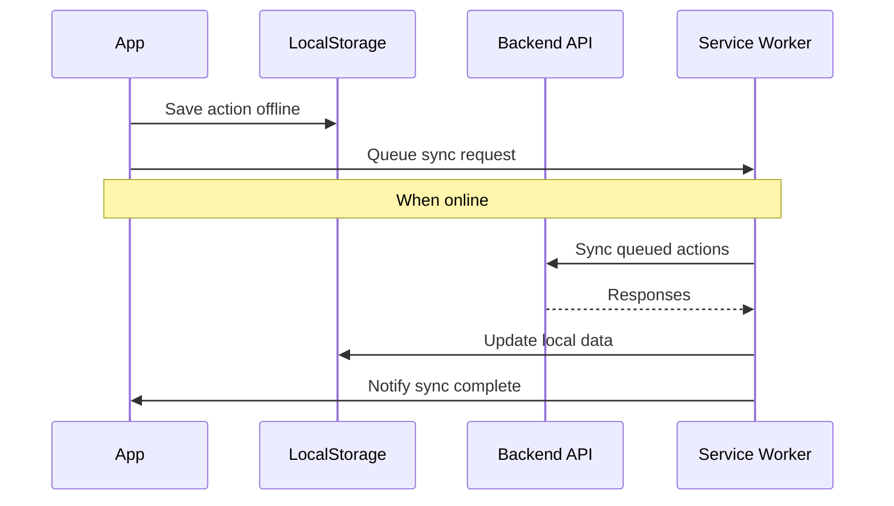

---

## Performance Optimization Flows

### Lazy Loading Flow
```javascript
// Component lazy loading
const Dashboard = lazy(() => import('./Dashboard'))
const StockAnalysis = lazy(() => import('./StockAnalysis'))

// Data lazy loading
function useInfiniteScroll() {
  const [page, setPage] = useState(1)
  const [hasMore, setHasMore] = useState(true)
  
  // Load more when scrolled to bottom
  onScroll → checkPosition → loadMore → setPage(page + 1)
}
```

### Debounced Search Flow
```javascript
// Search input debouncing
const [query, setQuery] = useState('')
const debouncedQuery = useDebounce(query, 300)

useEffect(() => {
  if (debouncedQuery) {
    searchStocks(debouncedQuery)
  }
}, [debouncedQuery])
```

---

## Security Flows

### Request Authentication Flow
```
Every API Request:
1. Extract JWT from Authorization header
2. Verify JWT signature
3. Check token expiration
4. Validate user permissions
5. Process request OR return 401/403
```

### Data Sanitization Flow
```
User Input → Validation → Sanitization → Database
    ↓            ↓            ↓            ↓
Raw Input    Joi Schema   XSS Clean   Parameterized Query
```
